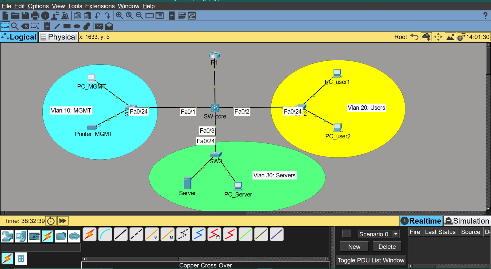

# Office Network Lab — SoufTech Solutions

A fully simulated enterprise network built in Cisco Packet Tracer.

## Architecture

## Features Implemented

- **3 VLANs** — Management (vlan 10), Users (vlan 20), Servers (vlan 30)
- **Inter-VLAN Routing** via Layer 3 Switch (SVI method)
- **DHCP Server** — centralized on SW-core for all VLANs
- **DNS Server** — internal name resolution (souftech.local)
- **Router R1** — gateway to external network
- **Full documentation** — IP plan, VLAN config, network diagram

## Technologies Used

- Cisco Packet Tracer
- Cisco IOS (Switching & Routing)
- VLANs, Trunking (802.1Q)
- SVI Inter-VLAN Routing
- DHCP, DNS

## Repository Structure

| Folder | Content |
|--------|---------|
| packet-tracer/ | .pkt simulation file |
| docs/ | IP plan & VLAN config |
| diagrams/ | Network topology diagram |

## Author

**Soufiane Hamssassia** — IT Support & Network Admin
Laayoune, Morocco | CCNA R-S & Security
